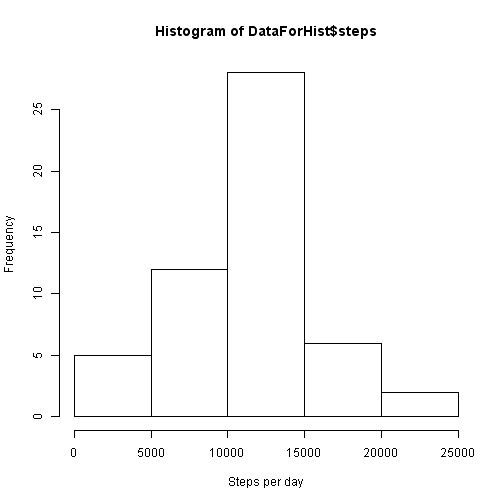
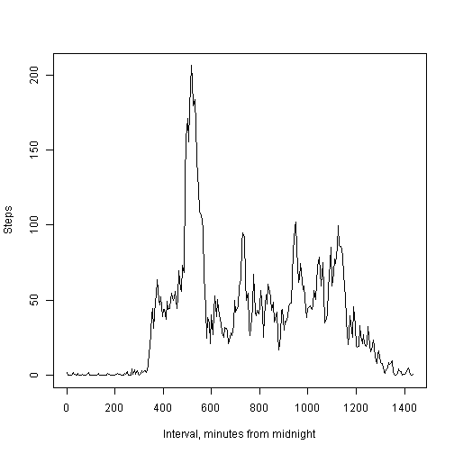
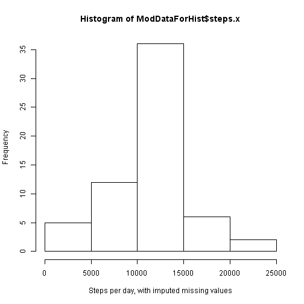
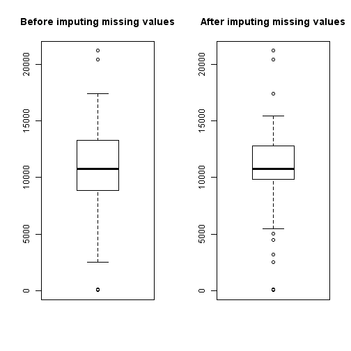
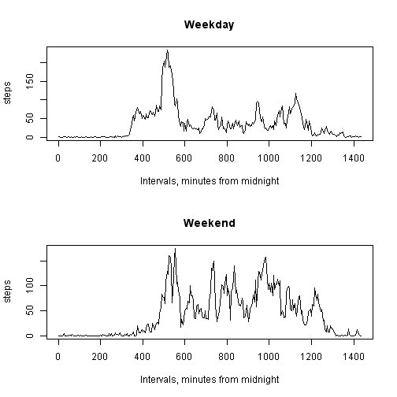

## Loading and preprocessing the data
As basic preprocessing I create additional columns:

* Dates in Date format
* Interval in HH:MM format
* Minutes from midnight
  

```r
library(stringr)
library(scales)
library(ggplot2)
setwd("D:/BeagleBone/Workspace/RWorkspace/RepData-peer1/RepData_PeerAssessment1")
AcData<-read.csv("./activity.csv")
AcData$intervalt<-str_pad(AcData$interval,4,pad="0")
AcData$intervalt<-paste(str_sub(AcData$intervalt,1,2),
                        str_sub(AcData$intervalt,3,4), sep=":")
AcData$dtStr<-paste(AcData$date,AcData$intervalt,sep=" ")
AcData$dates<-as.Date(AcData$date,"%Y-%m-%d")
AcData$WDay<-weekdays(AcData$dates)
AcData$MinFromMdn<-AcData$interval%/%100*60+
    AcData$interval-(AcData$interval%/%100*100)
```


## What is mean total number of steps taken per day?

```r
DataForHist<-aggregate(steps~dates,data=AcData,FUN=sum)
hist(DataForHist$steps,xlab="Steps per day")
```

 

Mean total number of steps taken per day:

```
## [1] 10766.19
```

Median total number of steps taken per day:

```
## [1] 10765
```

## What is the average daily activity pattern?

```r
steps_by_intervals<-aggregate(steps~MinFromMdn+intervalt,data=AcData,FUN=mean)
plot(steps_by_intervals$MinFromMdn,steps_by_intervals$steps,type="l",
     xlab="Interval, minutes from midnight", ylab="Steps")
```

 
  
Interval with maximum average number of steps is from 

```
## [1] "08:35"
```
to

```
## [1] "08:40"
```

## Imputing missing values
Missing values in steps column were replaces with mean values for given time
interval
  

```r
AcModData<-merge(AcData,steps_by_intervals,by = "MinFromMdn")
NAData<-is.na(AcModData$steps.x)
AcModData$steps.x[NAData]<-AcModData$steps.y[NAData]
ModDataForHist<-aggregate(steps.x~dates,data=AcModData,FUN=sum)
hist(ModDataForHist$steps.x,xlab="Steps per day, with imputed missing values")
```

 

```r
par(mfrow = c(1, 2))
boxplot(DataForHist$steps,main="Before imputing missing values")
boxplot(ModDataForHist$steps.x, main="After imputing missing values")
```

 

```r
par(old.par)  
```
  
Mean total number of steps taken per day (with imputed missing values):

```
## [1] 10766.19
```

Median total number of steps taken per day (with imputed missing values):

```
## [1] 10766.19
```
  
## Are there differences in activity patterns between weekdays and weekends?

```r
AcData$WDay<-weekdays(AcData$dates)
AcData$Wend<-ifelse(AcData$WDay=="суббота" | AcData$WDay=="воскресенье","weekend","weekday")
steps_by_intervalsWD<-aggregate(steps~MinFromMdn+Wend,data=AcData,FUN=mean)
par(mfrow = c(2, 1))
with(subset(steps_by_intervalsWD, Wend == "weekday"),
     plot(MinFromMdn, steps, type="l", main = "Weekday",
          xlab="Intervals, minutes from midnight"))
with(subset(steps_by_intervalsWD, Wend == "weekend"),
     plot(MinFromMdn, steps, type="l",main = "Weekend",
          xlab="Intervals, minutes from midnight"))
```

 
  
As we can see from the plots - at weekend walking activity starts later in time,
but steps are distributed evenly throughout the day.


